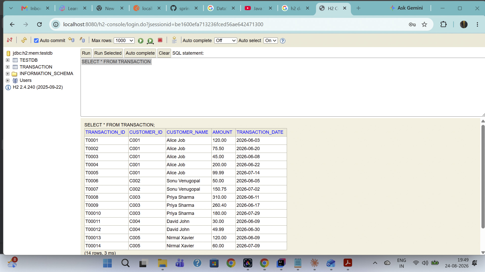
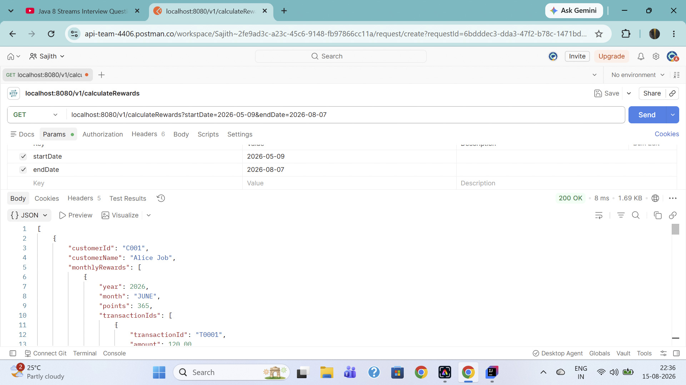
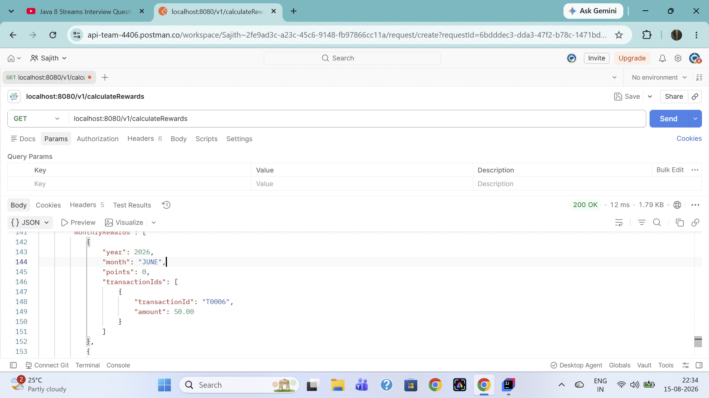
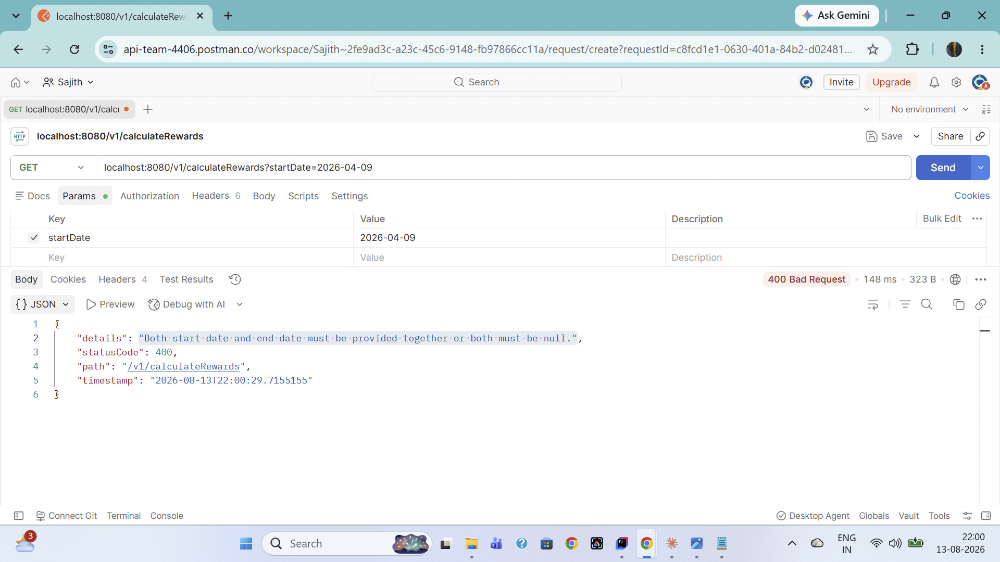
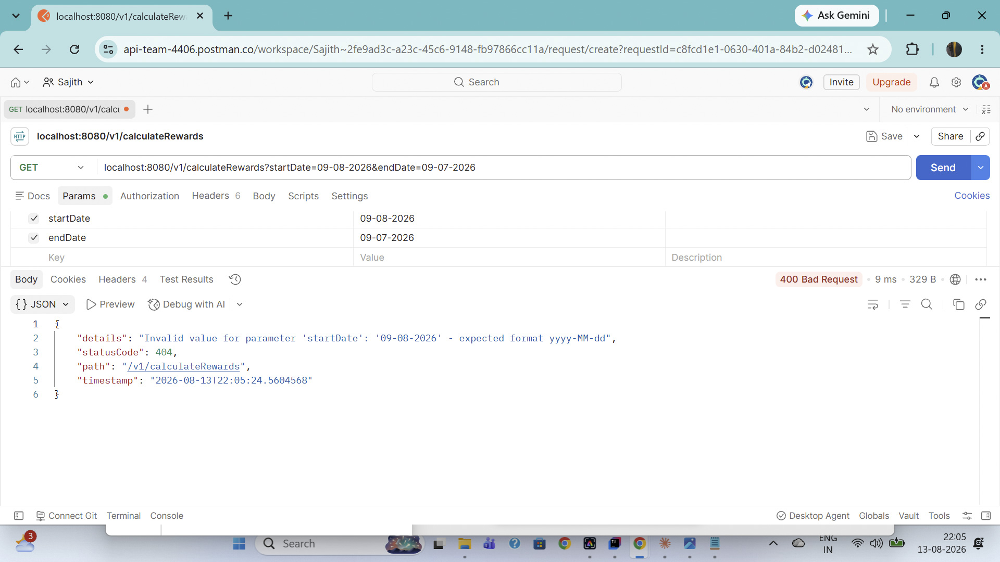
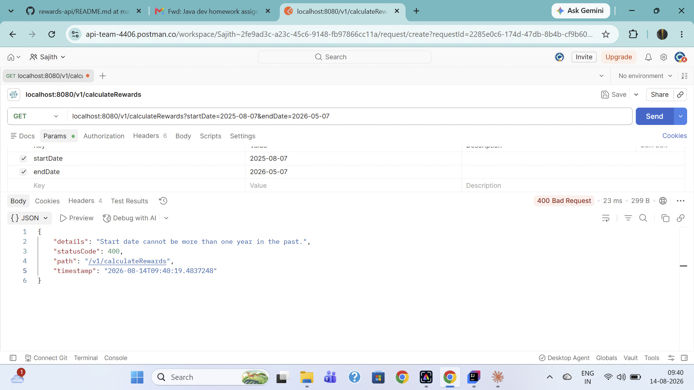
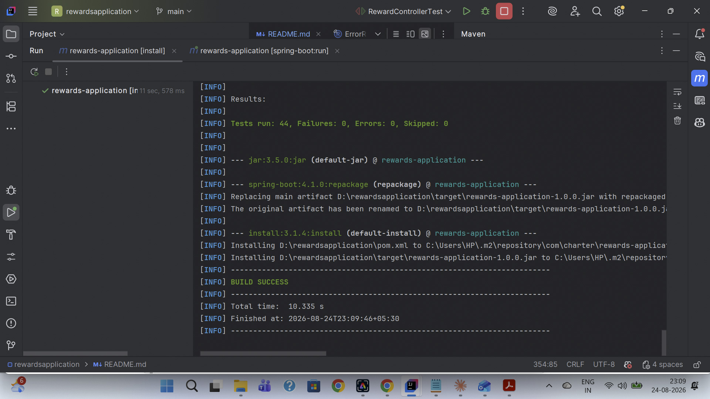

# Rewards Application

Calculates customer reward points from retail transactions.

## Rules

- 2 points for every dollar spent **over $100** in a transaction
- 1 point for every dollar spent **between $50 and $100** in a transaction
- Example: a $120 purchase = 2×$20 + 1×$50 = **90 points**
    - a $50 purchase = 0 points
    - a $75 purchase = 25 points
    - a $200 purchase = 2×$100 + 1×$50 = 250 points
    - a $51 purchase = 1 point
    - a $100 purchase = 50 points
### 1. Prerequisites
* **Java:** JDK 17 or higher
* **Build Tool:** Apache Maven 3.8+
### 2. Build the Project
Before running the tests, compile the source code and pack it into a JAR file:
```bash
mvn clean package
```
### 3. Run the Test Suite
To execute the automated unit and integration tests:
```bash
mvn test
```

### 4. Run it

```bash
mvn spring-boot:run
```
## Usage
Visit `http://localhost:8080` in your browser to use the application

## Test Cases

### Test Case 1: Standard Execution


```bash
curl http://localhost:8080/v1/calculateRewards?startDate=2026-05-09&endDate=2026-08-07
```

Returns each customer's points broken down by month, plus a running total, for the date range May 9, 2026 to August 7, 2026:

```json
[
  {
    "customerId": "C001",
    "customerName": "Alice Job",
    "monthlyRewards": [
      {
        "year": 2026,
        "month": "JUNE",
        "points": 365,
        "transactionIds": [
          { "transactionId": "T0001", "amount": 120.00 },
          { "transactionId": "T0002", "amount": 75.50 },
          { "transactionId": "T0003", "amount": 45.00 },
          { "transactionId": "T0004", "amount": 200.00 }
        ]
      },
      {
        "year": 2026,
        "month": "JULY",
        "points": 49,
        "transactionIds": [
          { "transactionId": "T0005", "amount": 99.99 }
        ]
      }
    ],
    "totalPoints": 414
  },
  {
    "customerId": "C004",
    "customerName": "David John",
    "monthlyRewards": [
      {
        "year": 2026,
        "month": "JUNE",
        "points": 0,
        "transactionIds": [
          { "transactionId": "T00011", "amount": 30.00 },
          { "transactionId": "T00012", "amount": 49.99 }
        ]
      }
    ],
    "totalPoints": 0
  },
  {
    "customerId": "C005",
    "customerName": "Nirmal Xavier",
    "monthlyRewards": [
      {
        "year": 2026,
        "month": "JUNE",
        "points": 90,
        "transactionIds": [
          { "transactionId": "T00013", "amount": 120.00 }
        ]
      },
      {
        "year": 2026,
        "month": "JULY",
        "points": 10,
        "transactionIds": [
          { "transactionId": "T00014", "amount": 60.00 }
        ]
      }
    ],
    "totalPoints": 100
  },
  {
    "customerId": "C003",
    "customerName": "Priya Sharma",
    "monthlyRewards": [
      {
        "year": 2026,
        "month": "JUNE",
        "points": 840,
        "transactionIds": [
          { "transactionId": "T0008", "amount": 310.00 },
          { "transactionId": "T0009", "amount": 260.40 }
        ]
      },
      {
        "year": 2026,
        "month": "JULY",
        "points": 210,
        "transactionIds": [
          { "transactionId": "T00010", "amount": 180.00 }
        ]
      }
    ],
    "totalPoints": 1050
  },
  {
    "customerId": "C002",
    "customerName": "Sonu Venugopal",
    "monthlyRewards": [
      {
        "year": 2026,
        "month": "JUNE",
        "points": 0,
        "transactionIds": [
          { "transactionId": "T0006", "amount": 50.00 }
        ]
      },
      {
        "year": 2026,
        "month": "JULY",
        "points": 150,
        "transactionIds": [
          { "transactionId": "T0007", "amount": 150.75 }
        ]
      }
    ],
    "totalPoints": 150
  }
]
```
### Test Case 2:  Execution without providing both dates
```bash
curl localhost:8080/v1/calculateRewards
```
Returns each customer's points broken down by month, plus a running total, for the default date range of the last 3 months:

```json
[
  {
    "customerId": "C001",
    "customerName": "Alice Job",
    "monthlyRewards": [
      {
        "year": 2026,
        "month": "JUNE",
        "points": 365,
        "transactionIds": [
          { "transactionId": "T0001", "amount": 120.00 },
          { "transactionId": "T0002", "amount": 75.50 },
          { "transactionId": "T0003", "amount": 45.00 },
          { "transactionId": "T0004", "amount": 200.00 }
        ]
      },
      {
        "year": 2026,
        "month": "JULY",
        "points": 49,
        "transactionIds": [
          { "transactionId": "T0005", "amount": 99.99 }
        ]
      }
    ],
    "totalPoints": 414
  },
  {
    "customerId": "C004",
    "customerName": "David John",
    "monthlyRewards": [
      {
        "year": 2026,
        "month": "JUNE",
        "points": 0,
        "transactionIds": [
          { "transactionId": "T00011", "amount": 30.00 },
          { "transactionId": "T00012", "amount": 49.99 }
        ]
      }
    ],
    "totalPoints": 0
  },
  {
    "customerId": "C005",
    "customerName": "Nirmal Xavier",
    "monthlyRewards": [
      {
        "year": 2026,
        "month": "JUNE",
        "points": 90,
        "transactionIds": [
          { "transactionId": "T00013", "amount": 120.00 }
        ]
      },
      {
        "year": 2026,
        "month": "JULY",
        "points": 10,
        "transactionIds": [
          { "transactionId": "T00014", "amount": 60.00 }
        ]
      },
      {
        "year": 2026,
        "month": "AUGUST",
        "points": 2,
        "transactionIds": [
          { "transactionId": "T00015", "amount": 52.00 }
        ]
      }
    ],
    "totalPoints": 102
  },
  {
    "customerId": "C003",
    "customerName": "Priya Sharma",
    "monthlyRewards": [
      {
        "year": 2026,
        "month": "JUNE",
        "points": 840,
        "transactionIds": [
          { "transactionId": "T0008", "amount": 310.00 },
          { "transactionId": "T0009", "amount": 260.40 }
        ]
      },
      {
        "year": 2026,
        "month": "JULY",
        "points": 210,
        "transactionIds": [
          { "transactionId": "T00010", "amount": 180.00 }
        ]
      }
    ],
    "totalPoints": 1050
  },
  {
    "customerId": "C002",
    "customerName": "Sonu Venugopal",
    "monthlyRewards": [
      {
        "year": 2026,
        "month": "JUNE",
        "points": 0,
        "transactionIds": [
          { "transactionId": "T0006", "amount": 50.00 }
        ]
      },
      {
        "year": 2026,
        "month": "JULY",
        "points": 150,
        "transactionIds": [
          { "transactionId": "T0007", "amount": 150.75 }
        ]
      }
    ],
    "totalPoints": 150
  }
]
```
### Test Case 3: Execution for date range above  three months
```bash
curl http://localhost:8080/v1/calculateRewards?startDate=2026-02-09&endDate=2026-08-07
```
Returns an error message,since date range exceeded three months

```json
{
  "details": "Date range cannot exceed three months.",
  "statusCode": 400,
  "path": "/v1/calculateRewards",
  "timestamp": "2026-08-13T22:09:27.2026099"
}
```
### Test Case 4: Execution for end date not provided
```bash
curl http://localhost:8080/v1/calculateRewards?startDate=2026-06-09
```
Returns an error message, since a date range requires both a start and end date:


```json
{
  "details": "Both start date and end date must be provided together or both must be null.",
  "statusCode": 400,
  "path": "/v1/calculateRewards",
  "timestamp": "2026-08-13T22:16:30.2366235"
}
```
### Test Case 5: Execution for start date not provided
```bash
curl http://localhost:8080/v1/calculateRewards?endDate=2026-08-07
````
Returns an error message, since `startDate` was not provided:
```json
{
  "details": "Both start date and end date must be provided together or both must be null.",
  "statusCode": 400,
  "path": "/v1/calculateRewards",
  "timestamp": "2026-08-13T22:16:30.2366235"
}
```
### Test Case 6: Execution for start date is after end date.
```bash
curl http://localhost:8080/v1/calculateRewards?startDate=2026-08-09&endDate=2026-05-07
```
Returns an error because the start date is after the end date:

```json
{
  "details": "Start date must be before or equal to end date.",
  "statusCode": 400,
  "path": "/v1/calculateRewards",
  "timestamp": "2026-08-12T22:38:59.1651701"
}
```
### Test Case 7: Execution for start date is more than one year in the past.
```bash
curl http://localhost:8080/v1/calculateRewards?startDate=2025-02-09&endDate=2026-08-07
```
Return an error since start date is more than one year in the past

```json
{
  "details": "Start date cannot be more than one year in the past.",
  "statusCode": 400,
  "path": "/v1/calculateRewards",
  "timestamp": "2026-08-24T22:55:12.5076046"
}
```
### Test Case 8: Executions for invalid start date formats .
```bash
curl http://localhost:8080/v1/calculateRewards?startDate=01-02-09&endDate=2026-08-07
```

Return an error since the date is not in expected format

```json
{
  "details": "Invalid value for parameter 'startDate': '01-02-09' - expected format yyyy-MM-dd",
  "statusCode": 404,
  "path": "/v1/calculateRewards",
  "timestamp": "2026-08-24T23:01:57.239126"
}
```
### Test Case 9: Executions for invalid end date formats .
```bash
curl http://localhost:8080/v1/calculateRewards?startDate=2026-02-09&endDate=26-08-07
```
Return an error since the date is not in expected format
```json
{
  "details": "Invalid value for parameter 'endDate': '26-08-07' - expected format yyyy-MM-dd",
  "statusCode": 404,
  "path": "/v1/calculateRewards",
  "timestamp": "2026-08-24T23:05:57.3371112"
}
```


## Screenshots

















## Health check

```bash
curl http://localhost:8080/actuator/health
```
## Prometheus metrics

```bash
curl http://localhost:8080/actuator/prometheus
```

## Design notes

- **`RewardService.calculatePoints`** is a small pure function — easy to
  unit test in isolation from HTTP/aggregation concerns.
- **`BigDecimal`** is used throughout for money instead of `double`, to
  avoid floating-point rounding errors on currency and to keep decimal
  precision accurate.
- Transactions are persisted in an **H2 in-memory database** via Spring
  Data JPA — `TransactionEntity` maps to the `TRANSACTION` table, and
  `TransactionRepository` (a `JpaRepository`) handles queries. Sample
  data is seeded through `data.sql` on startup. Swapping H2 for a
  production database (Postgres, MySQL, etc.) would only require
  changing the datasource configuration — the entity and repository
  layer stay the same.
- Aggregation groups by customer, then by `YearMonth`, using a
  `TreeMap` to keep months in chronological order in the response.